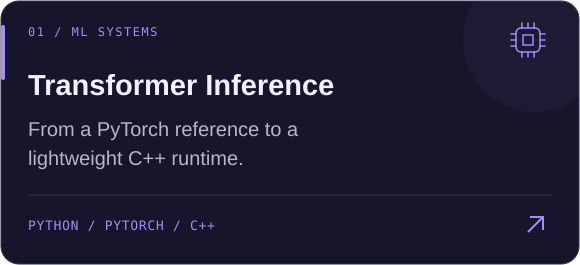
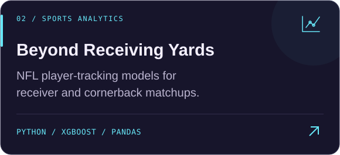
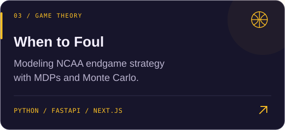
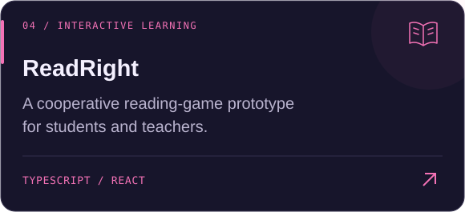

  

  

  
  
  

 

### A little about me

🎓 **Computer Science @ Johns Hopkins University** · Class of 2028 
🧠 I build across **machine learning, backend systems, and sports analytics**. 
🏈 Previously at the **Baltimore Ravens** and **Werfen**. 
⚾ Building [**LineupOptimization.com**](https://www.lineupoptimization.com/) — data-driven batting orders. 
🔬 Currently exploring **transformer inference**, from PyTorch to a C++ runtime.

 

<h3 align="center">My toolkit</h3>

LANGUAGES

  

APPS, DATA &amp; INFRASTRUCTURE

  

 

### Things I've been building

  
  

  
  

  <a href="https://github.com/shaque32?tab=repositories">Explore all my projects ↗</a>

 

  

